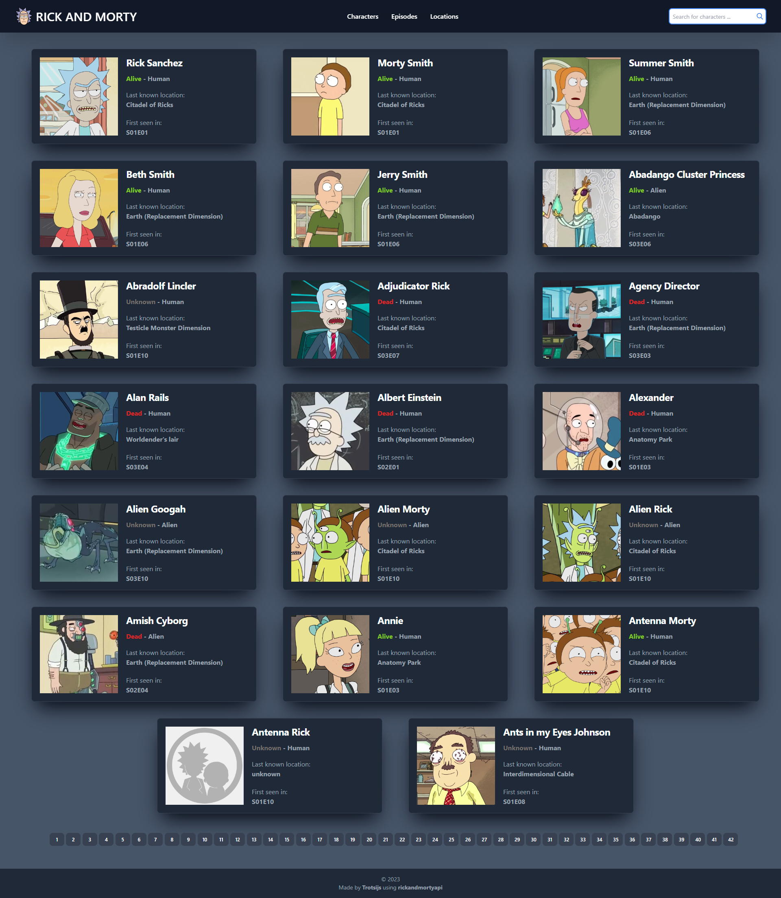
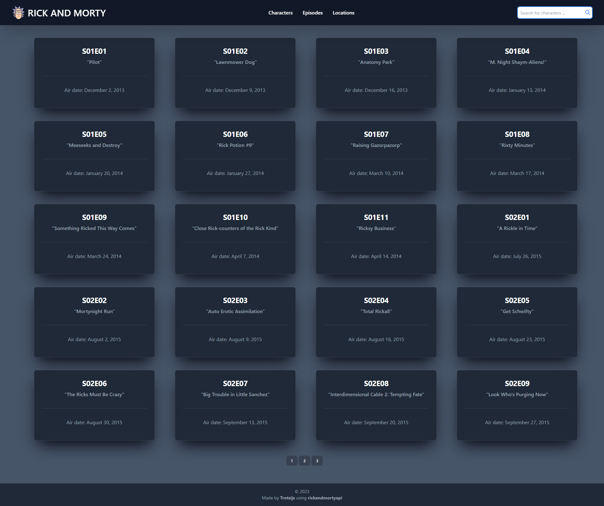
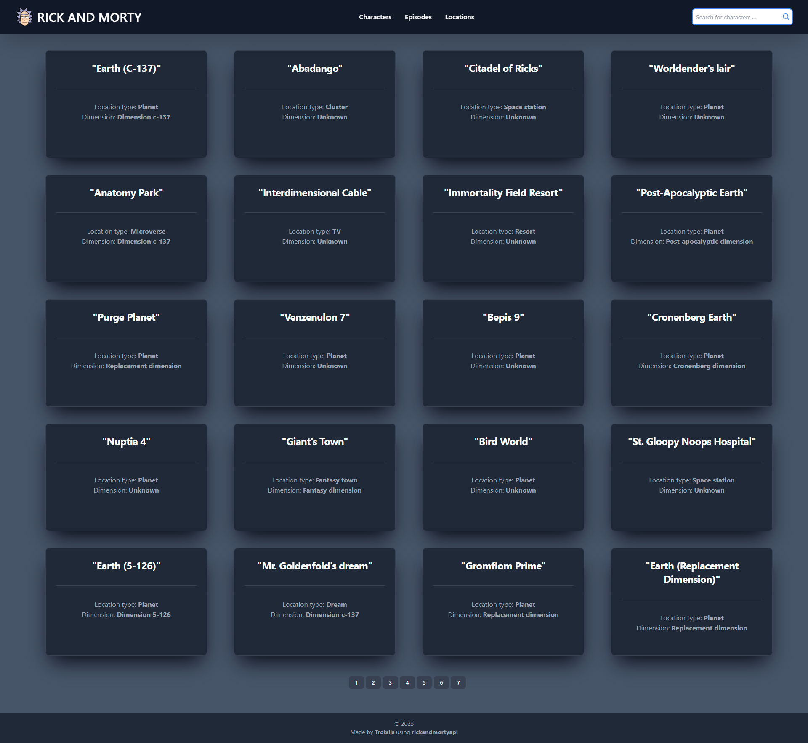

#  Rick and Morty [](https://www.php.net/)

Displays Information about Characters from the show.

### Preview:

Characters: <br><br>


Episodes: <br><br>


Locations: <br><br>


### Installation:

1. Clone or Download the project.
2. Run:
````
composer install
````
3. Create `cache` folder in your project root directory
4. Navigate to `/public` directory:
````php
cd .\public\
````
5. Start a server from the terminal
```php
php -S localhost:8000
```


6. Navigate to http://localhost:8000 to see the site.

### Resources:

* [Rick and Morty API](https://rickandmortyapi.com/documentation/)


